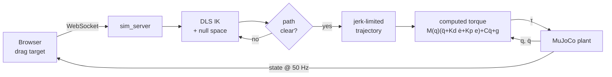
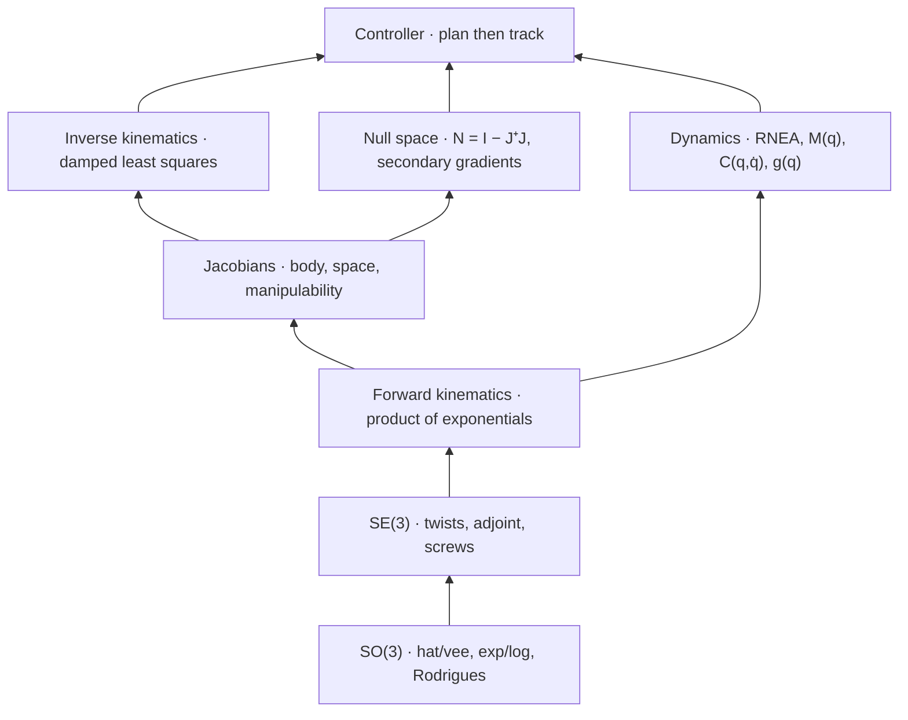

# SevenDOF

Motion control with redundancy resolution for a 7-DOF manipulator, implemented
from first principles in C++17

## Read THEORY.md first

One document holds all the derivations for this repository. The document covers
these topics:

- rotation groups
- screws and the product of exponentials
- body and space Jacobians
- damped least squares
- the null-space projector
- recursive Newton-Euler dynamics
- the parameterisation of jerk-limited trajectories
- computed-torque control

**[THEORY.md](THEORY.md)**

---

## About

A 6-DOF arm has six joints, and a pose has six dimensions. A solution of the
inverse kinematics gives an answer.

A 7-DOF arm has one more joint than the task needs. Thus it has an infinite
family of answers. This extra freedom is useful. The arm can hold the tool
exactly on the target and move its elbow at the same time. The elbow can move
away from an obstacle, away from a singularity, or away from a joint limit.

The choice of which answer to use is called redundancy resolution. Redundancy
resolution is the subject of this project.

This repository implements the maths from the Lie-group formulation of Lynch and
Park, *Modern Robotics*. The code does not use KDL, Pinocchio, or MoveIt.

**MuJoCo is the physics plant only.** It integrates the contact dynamics and the
rigid-body dynamics. It is also an independent oracle for checks of the maths.
But each model quantity that the controller uses comes from `libkinematics/` in
this repository.

## Summary

A move occurs in four stages:

1. **Goal.** A drag of the target in the browser sends a new position. Only a
   moved target or a moved obstacle triggers a replan. The control loop itself
   never triggers a replan.
2. **Solve.** The controller does one IK solve with damped least squares. It
   resolves the redundancy in the null space. It checks the candidate posture
   and the joint-space path to that posture for collisions against the real
   meshes in MuJoCo.
3. **Plan.** The controller builds a synchronised, jerk-limited profile over a
   single path parameter. Before the motion starts, it maps the per-joint limits
   for velocity, acceleration and jerk onto that parameter. Thus no joint can
   exceed its limit.
4. **Track.** Computed torque with full feedforward drives the arm along the
   trajectory to a complete stop. This stage runs at 50 Hz against a MuJoCo
   plant.

## System diagrams

### Runtime pipeline



### Library layers

Each layer passes its unit tests before the next layer builds on it.



## Technical details

This project implements rigid-body robotics from first principles instead of
from a library.

- The project implements the full kinematics and dynamics stack for a 7-DOF
  redundant manipulator in C++17 and Eigen. The stack contains:
  - SO(3) and SE(3) Lie groups
  - forward kinematics by the product of exponentials
  - body and space Jacobians
  - inverse kinematics by damped least squares
  - redundancy resolution in the null space
  - inverse dynamics by recursive Newton-Euler
- Tests verify each quantity against MuJoCo as an independent oracle over 1000
  random configurations. The forward kinematics agrees with MuJoCo to
  **1.3 × 10⁻¹⁴**. The inverse dynamics agrees to **1.5 × 10⁻¹³ N·m**.
- The motion controller first plans a move and then tracks it. It does one IK
  solve, builds a synchronised jerk-limited trajectory, and tracks it with
  computed torque. By construction, it holds each per-joint limit for velocity,
  acceleration and jerk. Across 14 test scenarios, it shows zero actuator
  saturation and zero tip-velocity reversals.
- The IK resolves the redundancy with an annealed null-space projection of four
  secondary objectives. The collision check covers the swept joint-space path,
  not only its endpoints. The four objectives are:
  - base facing
  - obstacle clearance
  - static-scenery clearance
  - joint-limit centering
- Fixed-point termination and stagnation termination in the IK descent cut the
  worst-case replan latency from 40.7 ms to **10.5 ms**. The realtime budget is
  20 ms. The measurement covers a 324-target workspace sweep.
- A browser dashboard receives the state over a WebSocket at 50 Hz. The
  dashboard uses React, TypeScript, three.js and MUI. It has draggable 3D
  markers for the target and the obstacle.

## Architecture

```
┌─────────────────┐      ┌─────────────────┐      ┌─────────────────┐      ┌─────────────────┐
│                 │      │                 │      │                 │      │                 │
│  libkinematics  │─────▶│   DLS IK   +    │─────▶│   Jerk-limited  │─────▶│ Computed torque │
│  FK · Jacobians │      │   null space    │      │   trajectory    │      │   τ = M(q)ü+…   │
│  M(q) · C · g   │      │   resolution    │      │   over s∈[0,1]  │      │   50 Hz         │
└─────────────────┘      └─────────────────┘      └─────────────────┘      └─────────────────┘
        │                        │                        │                        │
        └────────────────────────┴────────────────────────┴────────────────────────┘
                                         │
                              ┌──────────┴──────────┐
                              │   MuJoCo plant      │
                              │   + WebSocket UI    │
                              └─────────────────────┘
```

## Features

- **Drag-to-retarget:** Move the green sphere to any point in the workspace. The
  arm then plans a new move and executes it to a complete stop.
- **Obstacle avoidance in the null space:** The arm plans a posture that clears
  the red sphere. It does not use a reactive force that deflects the arm from
  its path.
- **Redundancy demo:** Switch the demo on. The elbow then sweeps its self-motion
  manifold, and the tool stays on the target.
- **Teach-pendant speed override:** At 25%, each planned move runs at a quarter
  of its speed. The limits scale by the same factor.
- **Correct treatment of continuous joints:** Joints 1, 3, 5 and 7 have no
  mechanical stop. Thus the controller measures displacements on the circle, and
  each move goes in the shorter direction.
- **All tunable values at startup:** One YAML file holds the limits, the gains, the IK
  settings and the alert thresholds. The server validates the file at startup.

## Tech stack

| Category | Technologies |
|---|---|
| Core maths | C++17, Eigen |
| Physics | MuJoCo 3.10 |
| Robot model | MJCF, screw axes and link inertias as YAML |
| Server | Plain CMake, vendored RFC6455 WebSocket, nlohmann/json, yaml-cpp |
| Frontend | React, TypeScript, Vite, three.js (@react-three/fiber), urdf-loader, MUI, chart.js |
| Testing | GoogleTest, Google Benchmark |

## Project structure

```
SevenDOF/
├── THEORY.md                       # the derivations (start here)
├── CMakeLists.txt                  # one command builds the maths + tests
├── libkinematics/                  # the point of the project
│   ├── include/libkinematics/      #   public headers
│   ├── src/math/                   #   SO(3), SE(3)
│   ├── src/                        #   fk, jacobian, ik, dynamics, null_space, robot
│   ├── test/                       #   35 GoogleTest cases + MuJoCo reference CSVs
│   └── tools/kin_report.cpp        #   FK/IK/redundancy numbers in the terminal
├── webviz/
│   ├── config.yaml                 #   all tuning, read at startup
│   ├── server/                     #   MuJoCo plant + controller + WebSocket
│   │   ├── redundancy_controller.* #     IK, trajectory, computed torque
│   │   ├── diag_motion.cpp         #     motion-quality profiler
│   │   └── test_reach.cpp          #     accuracy + avoidance battery
│   └── app/src/                    #   React + three.js dashboard
├── kinova_gen2_description/        # MJCF, screws/inertias YAML, meshes, scene
├── benchmarks/                     # micro-benchmarks (optional)
└── scripts/run_webviz.sh           # builds the server, starts both halves
```

## Performance

### Correctness

The table shows the worst error against MuJoCo. MuJoCo computes the same
quantities by unrelated algorithms. The comparison covers 1000 random
configurations, and 50 configurations for the mass matrix.

| Quantity | Worst error |
|---|---|
| FK tool pose | 1.3 × 10⁻¹⁴ |
| FK link positions | 5.3 × 10⁻¹⁵ m |
| Mass matrix `M(q)` | 8.9 × 10⁻¹⁵ kg·m² |
| Gravity `g(q)` | 1.4 × 10⁻¹³ N·m |
| Inverse dynamics `τ` | 1.5 × 10⁻¹³ N·m |
| IK round trip | 99.6% success, 0.045 ms median |

Some quantities have no external oracle. Tests check these quantities against an
independent construction:

- the body Jacobian against a 5-point numerical derivative
- the space Jacobian against the left-accumulated screw form
- the Coriolis matrix against the Newton-Euler recursion

### Motion quality

| Metric | Value |
|---|---|
| Final tip error | ≤ 0.2 mm |
| Overshoot past the target | ≤ 1.1 mm |
| Peak joint rate | 0.83 rad/s (= the configured cap) |
| Actuator saturation | 0.0% of steps |
| Residual motion once settled | 0.0000 m/s |
| Tip-velocity reversals | 0 |

### Realtime

| Metric | Value |
|---|---|
| Steady control step | 15 µs |
| Replan, median / p99 | 0.30 ms / 0.41 ms |
| Replan, worst over a 324-target sweep | 10.5 ms |
| Ticks over the 20 ms budget | 0 of 324 |

### Hot paths

The timings are from an Apple M-series machine with `-O3`. The configurations
come from a pool that the benchmark builds outside the timed loop.

| Operation | Time |
|---|---|
| FK, tool pose | 440 ns |
| FK, all link poses | 480 ns |
| Body Jacobian | 535 ns |
| Space Jacobian | 1050 ns |
| Inverse dynamics (RNE) | 990 ns |
| Mass matrix | 7.2 µs |

This is sample output from the motion profiler, `diag_motion`:

```
target                       err_mm    vmax    amax    jmax  qd_max   sat%  over_mm   resid   rev
front-high [0.50,0,0.55]        0.0    0.33     0.7     547    0.62    0.0      0.6  0.0000     0
front-low  [0.52,-.01,0.34]     0.1    0.31     0.7     668    0.62    0.0      0.3  0.0000     0
right      [0.60,0.30,0.30]     0.1    0.33     0.7     467    0.62    0.0      0.3  0.0000     0
left-high  [0.30,-.30,0.70]     0.1    0.35     0.7     467    0.83    0.0      0.2  0.0000     0
far-front  [0.65,0,0.45]        0.1    0.28     0.6     594    0.62    0.0      0.6  0.0000     0
diag       [0.35,0.35,0.55]     0.0    0.42     0.9     364    0.62    0.0      0.3  0.0000     0
```

The `rev` column is the count of reversals of the tip-velocity direction. A
reversal shows that the arm oscillates near its target. The count is zero in
each scenario.

## Quick start

### Prerequisites

- A C++17 compiler and CMake 3.16+
- Eigen and yaml-cpp. To install them, run `brew install eigen yaml-cpp`.
- For the demo only: MuJoCo and Node 18+. To install MuJoCo, run
  `pip install mujoco`.

### Build and test the maths

```bash
git clone https://github.com/<you>/SevenDOF.git
cd SevenDOF

cmake -S . -B build && cmake --build build
ctest --test-dir build
```

The build does not need ROS, a container, or a workspace setup. If GoogleTest is
not installed, the build downloads it automatically.

### Run the dashboard

```bash
( cd webviz/app && npm install )   # one-time
./scripts/run_webviz.sh            # then open http://localhost:5173
```

### Other commands

```bash
./build/libkinematics/kin_report          # FK/IK/redundancy numbers in the terminal
ctest --test-dir webviz/server/build      # controller + reach tests
./webviz/server/build/diag_motion         # the motion-quality table above
./scripts/run_benchmarks.sh               # micro-benchmarks (needs Google Benchmark)
```

## The robot model

The robot is the **Kinova Gen2 `j2s7s300`**, the standard 7-DOF research arm.

- It has 7 revolute joints, a 6-dimensional task space, and 1 redundant degree
  of freedom.
- Joints 1, 3, 5 and 7 are continuous. Joints 2, 4 and 6 have mechanical stops.
- Three descriptions of the robot must agree. The MJCF gives the physics, the
  screw axes give the kinematics, and the link inertias give the dynamics.

An independent reconstruction of the screw parameters from the body frames of
the MJCF reproduces the YAML. The agreement is 2.4 × 10⁻¹⁶ on the home position
and 1.6 × 10⁻¹⁵ on all seven screw axes. This agreement justifies the use of
MuJoCo as an oracle everywhere else.

## Scope

- Obstacle avoidance projects gradients into the null space. This projection
  works along the self-motion manifold. It works weakly perpendicular to the
  manifold. Omnidirectional clearance needs a task-priority QP. The project does
  not implement a task-priority QP. See
  [THEORY.md §9](THEORY.md#9-redundancy-resolution-the-null-space).
- The screw YAML declares ±π limits for joints 1, 3, 5 and 7. These joints are
  physically continuous. The controller derives the continuity from the plant.
  But the IK in `libkinematics` still clamps. Thus `kin_report` can return a
  joint at exactly ±3.1416.
- The controller does not bound the Cartesian acceleration directly. The joint
  limits hold everywhere. But a retarget during a move peaks at 4.5 m/s² of tip
  acceleration. The peak for a steady reach is under 1.3 m/s².
- The project has one robot, one scene, and simulation only. There is no
  hardware support.
