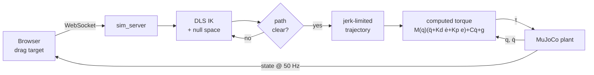
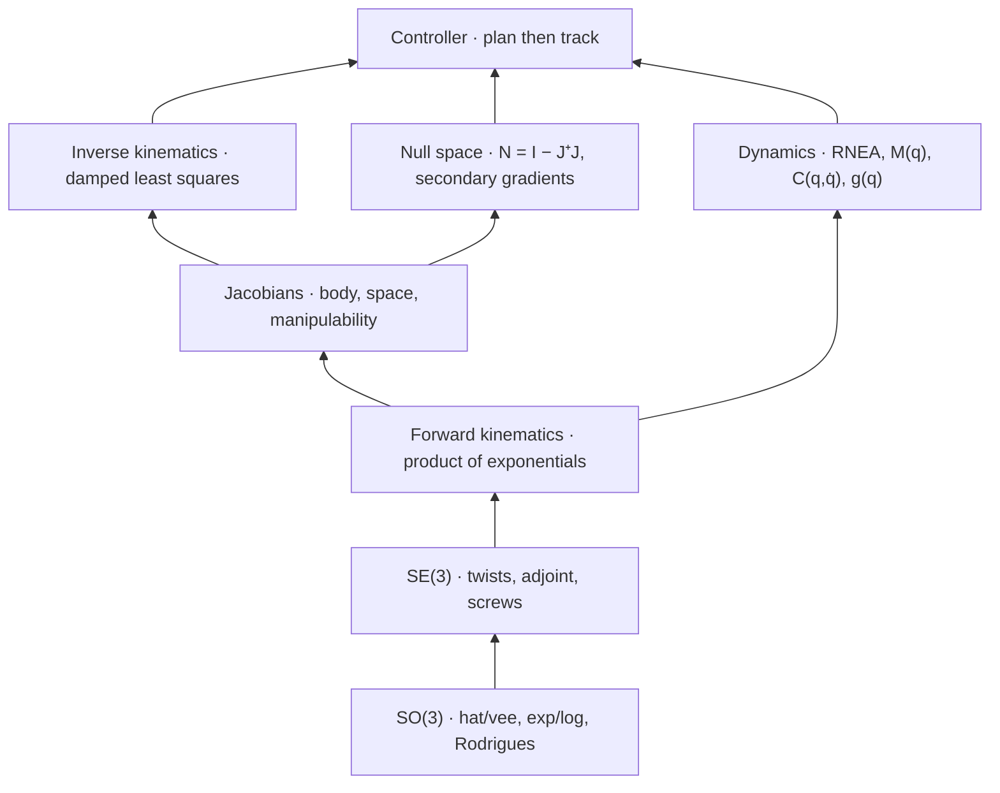

# SevenDOF

Redundancy-Resolving Motion Control for a 7-DOF Manipulator, written from scratch in C++17

## ‼️ Read THEORY.md ‼️

Every derivation behind this repo lives in one document: rotation groups, screws
and the product of exponentials, body and space Jacobians, damped least squares,
the null-space projector, recursive Newton-Euler dynamics, jerk-limited
trajectory parameterisation, and computed-torque control. It is written to be
read start to finish, not skimmed as reference.

**[THEORY.md](THEORY.md)**

---

## About

A 6-DOF arm has exactly enough joints to reach a pose. Solve the inverse
kinematics and you get an answer.

A 7-DOF arm has one joint too many, so it has an infinite family of answers. The
extra freedom buys you something real: the arm can hold the tool exactly on
target *while* moving its elbow out of the way of an obstacle, away from a
singularity, or off a joint limit. Picking which answer to use is called
redundancy resolution, and it is what this project is about.

The maths is written by hand from the Lie-group formulation (Lynch & Park,
*Modern Robotics*). Nothing comes from KDL, Pinocchio, or MoveIt. **MuJoCo is the
physics plant only.** It integrates contact and rigid-body dynamics and serves as
an independent oracle to check the maths against, but every model quantity the
controller consumes comes out of `libkinematics/` in this repo.

## Summary

A move happens in four stages:

1. **Goal.** Dragging the target in the browser sends a new position. Only a
   moved target or obstacle triggers a replan, never the control loop itself.
2. **Solve.** One damped-least-squares IK solve, with the redundancy resolved in
   the null space. Both the candidate posture and the joint-space path to it are
   collision-checked against MuJoCo's real meshes.
3. **Plan.** A synchronised, jerk-limited profile over a single path parameter.
   Per-joint velocity, acceleration and jerk limits are mapped onto that
   parameter before motion begins, so no joint can exceed its cap.
4. **Track.** Computed torque with full feedforward drives the arm along the
   trajectory to a complete stop, at 50 Hz against a MuJoCo plant.

## System diagrams

### Runtime pipeline



### Library layering

Each layer is unit-tested before the next is stacked on it.



## Technical details

My project to teach myself rigid-body robotics by implementing all of it rather
than calling a library.

- Implemented the full kinematics and dynamics stack for a 7-DOF redundant
  manipulator in C++17 and Eigen: SO(3)/SE(3) Lie groups, product-of-exponentials
  forward kinematics, body and space Jacobians, damped-least-squares inverse
  kinematics, null-space redundancy resolution, and recursive Newton-Euler
  inverse dynamics
- Verified every quantity against MuJoCo as an independent oracle over 1000
  random configurations, agreeing to **1.3 × 10⁻¹⁴** on forward kinematics and
  **1.5 × 10⁻¹³ N·m** on inverse dynamics
- Built a plan-then-track motion controller (one IK solve, a synchronised
  jerk-limited trajectory, computed-torque tracking) that holds every per-joint
  velocity, acceleration and jerk limit by construction, with zero actuator
  saturation and zero tip-velocity reversals across 14 test scenarios
- Resolved redundancy inside the IK using an annealed null-space projection of
  four secondary objectives (base facing, obstacle clearance, static-scenery
  clearance, joint-limit centering), with collision checking of the swept
  joint-space path rather than only its endpoints
- Cut worst-case replan latency from 40.7 ms to **10.5 ms** against a 20 ms
  realtime budget by adding fixed-point and stagnation termination to the IK
  descent, measured over a 324-target workspace sweep
- Built a browser dashboard (React, TypeScript, three.js, MUI) streaming state
  over a WebSocket at 50 Hz, with draggable 3D target and obstacle markers

## Architecture

```
┌─────────────────┐      ┌─────────────────┐      ┌─────────────────┐      ┌─────────────────┐
│                 │      │                 │      │                 │      │                 │
│  libkinematics  │─────▶│   DLS IK   +    │─────▶│   Jerk-limited  │─────▶│ Computed torque │
│  FK · Jacobians │      │   null space    │      │   trajectory    │      │   τ = M(q)ü+…   │
│  M(q) · C · g   │      │   resolution    │      │   over s∈[0,1]  │      │   50 Hz         │
└─────────────────┘      └─────────────────┘      └─────────────────┘      └─────────────────┘
        │                        │                        │                        │
        └────────────────────────┴────────────────────────┴────────────────────────┘
                                         │
                              ┌──────────┴──────────┐
                              │   MuJoCo plant      │
                              │   + WebSocket UI    │
                              └─────────────────────┘
```

## Features

- **Drag-to-retarget:** move the green sphere anywhere in the workspace and the
  arm plans a fresh move and executes it to a complete stop
- **Obstacle avoidance in the null space:** the arm *plans* a posture that clears
  the red sphere rather than being shoved off course by a reactive force
- **Redundancy demo:** toggle it on and the elbow sweeps its self-motion manifold
  while the tool stays pinned on the target
- **Teach-pendant speed override:** at 25% every planned move runs at a quarter
  speed, limits and all
- **Continuous joints handled properly:** joints 1/3/5/7 have no mechanical stop,
  so displacements are measured on the circle and moves take the short way round
- **Everything tunable at startup:** one YAML file for limits, gains, IK settings
  and alerting thresholds, validated on load

## Tech stack

| Category | Technologies |
|---|---|
| Core maths | C++17, Eigen |
| Physics | MuJoCo 3.10 |
| Robot model | MJCF, screw axes and link inertias as YAML |
| Server | Plain CMake, vendored RFC6455 WebSocket, nlohmann/json, yaml-cpp |
| Frontend | React, TypeScript, Vite, three.js (@react-three/fiber), urdf-loader, MUI, chart.js |
| Testing | GoogleTest, Google Benchmark |

## Project structure

```
SevenDOF/
├── THEORY.md                       # the derivations (start here)
├── CMakeLists.txt                  # one command builds the maths + tests
├── libkinematics/                  # the point of the project
│   ├── include/libkinematics/      #   public headers
│   ├── src/math/                   #   SO(3), SE(3)
│   ├── src/                        #   fk, jacobian, ik, dynamics, null_space, robot
│   ├── test/                       #   35 GoogleTest cases + MuJoCo reference CSVs
│   └── tools/kin_report.cpp        #   FK/IK/redundancy numbers in the terminal
├── webviz/
│   ├── config.yaml                 #   all tuning, read at startup
│   ├── server/                     #   MuJoCo plant + controller + WebSocket
│   │   ├── redundancy_controller.* #     IK, trajectory, computed torque
│   │   ├── diag_motion.cpp         #     motion-quality profiler
│   │   └── test_reach.cpp          #     accuracy + avoidance battery
│   └── app/src/                    #   React + three.js dashboard
├── kinova_gen2_description/        # MJCF, screws/inertias YAML, meshes, scene
├── benchmarks/                     # micro-benchmarks (optional)
└── scripts/run_webviz.sh           # builds the server, starts both halves
```

## Performance

### Correctness

Against MuJoCo computing the same quantities by unrelated algorithms, over 1000
random configurations (50 for the mass matrix):

| Quantity | Worst error |
|---|---|
| FK tool pose | 1.3 × 10⁻¹⁴ |
| FK link positions | 5.3 × 10⁻¹⁵ m |
| Mass matrix `M(q)` | 8.9 × 10⁻¹⁵ kg·m² |
| Gravity `g(q)` | 1.4 × 10⁻¹³ N·m |
| Inverse dynamics `τ` | 1.5 × 10⁻¹³ N·m |
| IK round trip | 99.6% success, 0.045 ms median |

Quantities with no external oracle are pinned against an independent
construction: the body Jacobian against a 5-point numerical derivative, the space
Jacobian against the left-accumulated screw form, the Coriolis matrix against the
Newton-Euler recursion.

### Motion quality

| Metric | Value |
|---|---|
| Final tip error | ≤ 0.2 mm |
| Overshoot past the target | ≤ 1.1 mm |
| Peak joint rate | 0.83 rad/s (= the configured cap) |
| Actuator saturation | 0.0% of steps |
| Residual motion once settled | 0.0000 m/s |
| Tip-velocity reversals | 0 |

### Realtime

| Metric | Value |
|---|---|
| Steady control step | 15 µs |
| Replan, median / p99 | 0.30 ms / 0.41 ms |
| Replan, worst over a 324-target sweep | 10.5 ms |
| Ticks over the 20 ms budget | 0 of 324 |

### Hot paths

Apple M-series, `-O3`, configurations drawn from a pool built outside the timed
loop:

| Operation | Time |
|---|---|
| FK, tool pose | 440 ns |
| FK, all link poses | 480 ns |
| Body Jacobian | 535 ns |
| Space Jacobian | 1050 ns |
| Inverse dynamics (RNE) | 990 ns |
| Mass matrix | 7.2 µs |

Sample output from the motion profiler (`diag_motion`):

```
target                       err_mm    vmax    amax    jmax  qd_max   sat%  over_mm   resid   rev
front-high [0.50,0,0.55]        0.0    0.33     0.7     547    0.62    0.0      0.6  0.0000     0
front-low  [0.52,-.01,0.34]     0.1    0.31     0.7     668    0.62    0.0      0.3  0.0000     0
right      [0.60,0.30,0.30]     0.1    0.33     0.7     467    0.62    0.0      0.3  0.0000     0
left-high  [0.30,-.30,0.70]     0.1    0.35     0.7     467    0.83    0.0      0.2  0.0000     0
far-front  [0.65,0,0.45]        0.1    0.28     0.6     594    0.62    0.0      0.6  0.0000     0
diag       [0.35,0.35,0.55]     0.0    0.42     0.9     364    0.62    0.0      0.3  0.0000     0
```

`rev` is the count of tip-velocity direction reversals, the signature of an arm
hunting around its target. Zero across every scenario.

## Quick start

### Prerequisites

- A C++17 compiler and CMake 3.16+
- Eigen and yaml-cpp (`brew install eigen yaml-cpp`)
- For the demo only: MuJoCo (`pip install mujoco`) and Node 18+

### Build and test the maths

```bash
git clone https://github.com/<you>/SevenDOF.git
cd SevenDOF

cmake -S . -B build && cmake --build build
ctest --test-dir build
```

No ROS, no container, no workspace setup. GoogleTest is fetched automatically if
it is not installed.

### Run the dashboard

```bash
( cd webviz/app && npm install )   # one-time
./scripts/run_webviz.sh            # then open http://localhost:5173
```

### Other things to run

```bash
./build/libkinematics/kin_report          # FK/IK/redundancy numbers in the terminal
ctest --test-dir webviz/server/build      # controller + reach tests
./webviz/server/build/diag_motion         # the motion-quality table above
./scripts/run_benchmarks.sh               # micro-benchmarks (needs Google Benchmark)
```

## The robot model

**Kinova Gen2 `j2s7s300`**, the standard 7-DOF research arm.

- 7 revolute joints, 6-dimensional task space, 1 redundant degree of freedom
- Joints 1, 3, 5, 7 are continuous; 2, 4, 6 have mechanical stops
- Described three ways that must agree: MJCF for the physics, screw axes for the
  kinematics, link inertias for the dynamics

Rebuilding the screw parameters independently from the MJCF's body frames
reproduces the YAML to 2.4 × 10⁻¹⁶ on the home position and 1.6 × 10⁻¹⁵ on all
seven screw axes, which is what licenses using MuJoCo as an oracle everywhere
else.

## Scope

- Obstacle avoidance projects gradients into the null space, which works along
  the self-motion manifold and weakly perpendicular to it. Omnidirectional
  clearance needs a task-priority QP, which is not implemented. See
  [THEORY.md §9](THEORY.md#9-redundancy-resolution-the-null-space).
- The screw YAML declares ±π limits for joints 1/3/5/7, which are physically
  continuous. The controller derives continuity from the plant, but
  `libkinematics`' own IK still clamps, so `kin_report` can return a joint pinned
  at exactly ±3.1416.
- Cartesian acceleration is not bounded directly. Joint limits hold everywhere,
  but a mid-flight retarget peaks at 4.5 m/s² of tip acceleration against under
  1.3 for a steady reach.
- One robot, one scene, simulation only. No hardware.
